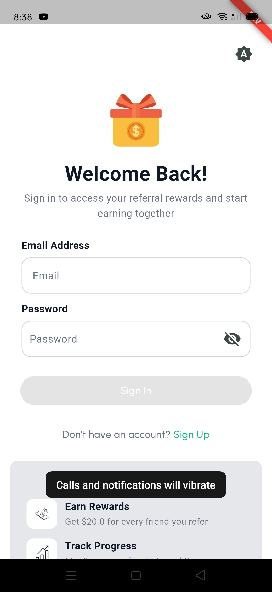
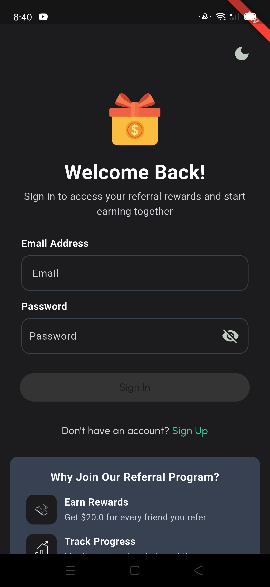
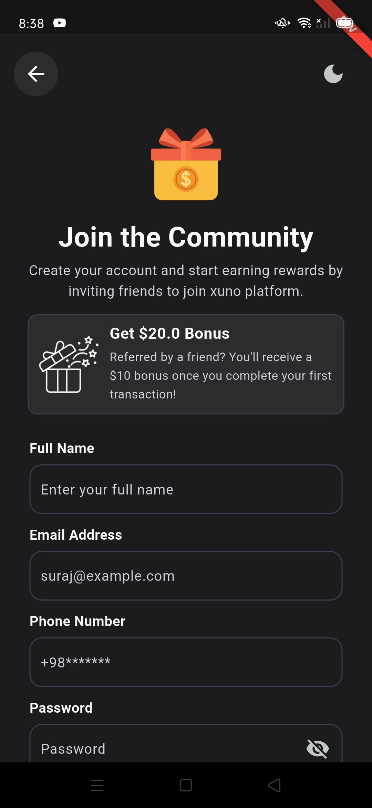
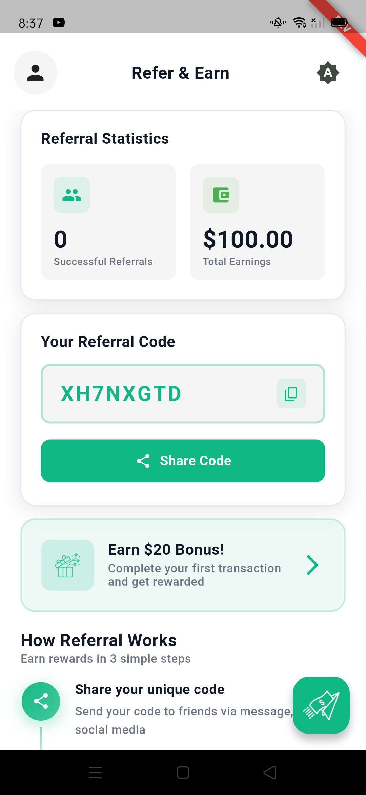
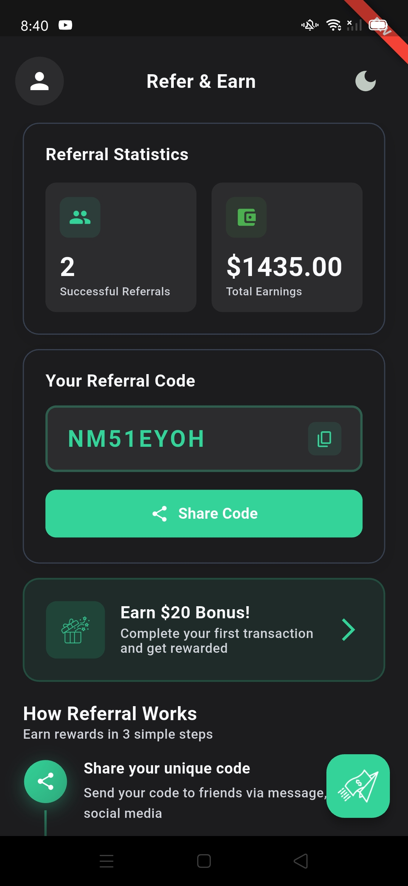
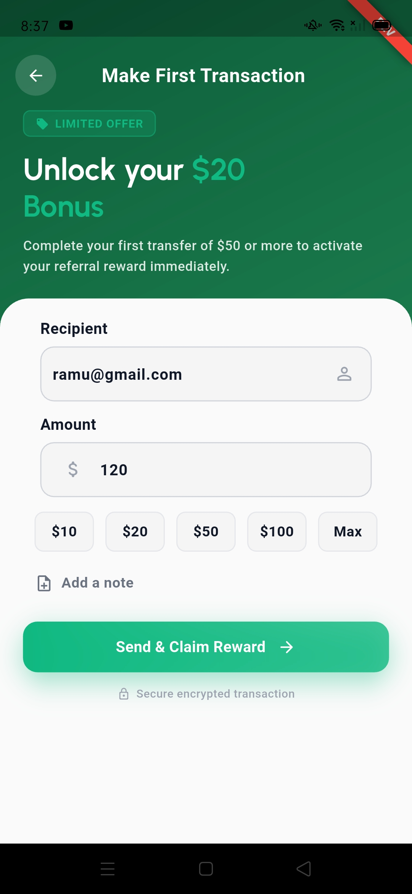
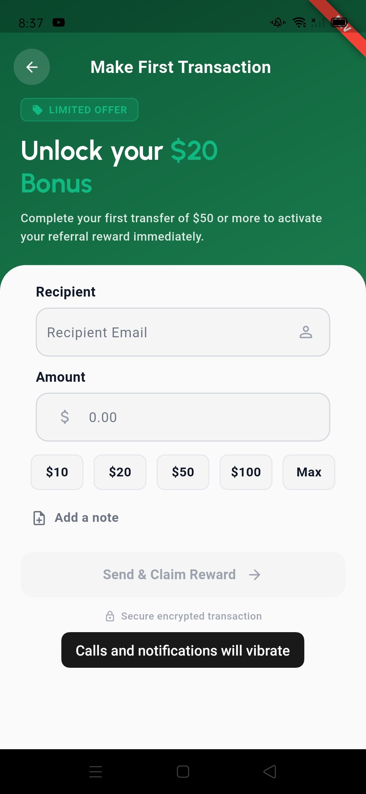
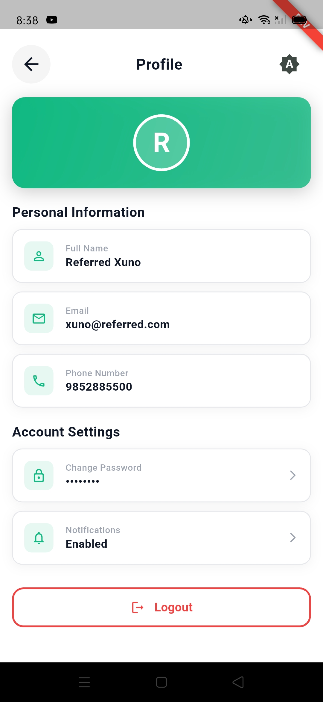
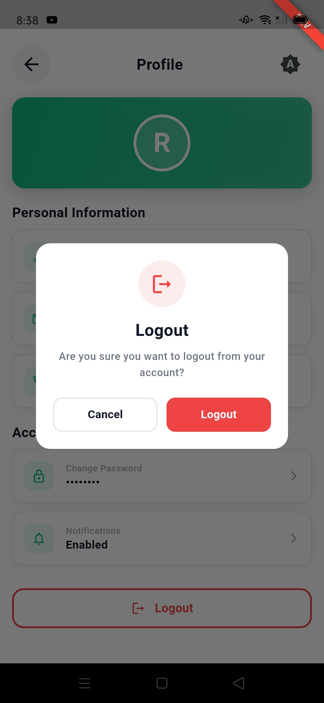

# Referral App

A referral app that lets users easily invite friends, track referrals, and earn rewards for every successful signup.

---

## Table of Contents

- [Architecture Approach](#architecture-approach)
- [Backend & Sample Code](#backend--sample-code)
- [Referral System Business Logic](#referral-system-business-logic)
- [Running the App](#running-the-app)
- [Testing Instructions](#testing-instructions)
- [App Screenshots](#app-screenshots)

---

## Architecture Approach

### State Management: BLoC/Cubit Pattern

- **BLoC** for complex state management (Dashboard, Transaction)
- **Cubit** for simpler state (Theme, Splash)
- Unidirectional data flow: Event → BLoC → State

### Layered Architecture (Clean Architecture)

Three-layer structure with feature-based organization:

1. **Presentation Layer**: UI components, BLoCs/Cubits
2. **Domain Layer**: Business logic, use cases, repository interfaces
3. **Data Layer**: Repository implementations, data models, Supabase integration

**Project Structure**:
```
lib/
├── app/              # App-level configuration
├── core/             # Shared utilities (DI, routing, network)
├── feature/          # Feature modules (auth, dashboard, transaction)
│   └── [feature]/
│       ├── data/     # Data layer
│       ├── domain/   # Domain layer
│       └── presentation/ # Presentation layer
└── shared/          # Shared across features
```

**Data Flow**:
```
UI → BLoC/Cubit → UseCase → Repository → Supabase
```

---

## Backend & Sample Code

### Supabase Backend

The app uses **Supabase** for:
- **Data Storage**: PostgreSQL database (users, wallets, transactions, referrals)
- **Session Management**: Supabase Auth with secure token storage
- **Authentication**: Email/password authentication


### REST API Sample Code (For Study)

Sample REST API integration code is included for reference:

**Location**:
- Network client: `lib/core/network/client/`
- Sample usage: `lib/feature/auth/signIn/data/repository_impl/signin_repository_impl.dart`

**Components**:
- `BaseClient`: Abstract interface for HTTP methods (GET, POST, PUT, PATCH, DELETE)
- `BaseClientImpl`: Complete Dio-based implementation with token refresh, caching, error handling
- Helper functions: `get_header.dart`, `get_parsed_data.dart`

The sample code demonstrates how to integrate REST API endpoints if needed in the future.

---

## Referral System Business Logic

### How It Works

1. **User Registration**:
   - New users can sign up with or without a referral code
   - Each user gets a unique referral code upon registration
   - Opening wallet balance: **100**

2. **Referral Process**:
   - User A shares their referral code with User B
   - User B signs up using User A's referral code
   - User B completes their **first transaction**
   - User B and User A receives a reward automatically

3. **Transaction Flow**:
   - Users can send money to other users by email
   - Transactions update wallet balances
   - Transaction history is maintained per user
   - First transaction by a referred user triggers the referral reward

4. **Wallet System**:
   - Each user has a wallet with balance tracking
   - Wallet balance updates with each transaction
   - Transaction history shows all sent/received transactions

---

## Running the App

### Prerequisites

- Flutter SDK 3.38.0+
- Dart SDK 3.10.0+
- Supabase project configured

### Setup

1. **Install dependencies**:
   ```sh
   flutter pub get
   ```

2. **Run code generation** (if models modified):
   ```sh
   dart run build_runner build --delete-conflicting-outputs
   ```

3. **Configure Supabase**:
   - Set up Supabase project credentials
   - Configure database schema (users, wallets, transactions, referrals)
   - Enable Supabase Auth

### Run Commands

This project has 3 flavors:

```sh
# Development
flutter run --flavor development --target lib/main_development.dart

# Staging
flutter run --flavor staging --target lib/main_staging.dart

# Production
flutter run --flavor production --target lib/main_production.dart
```

---

## Testing Instructions

### Test Accounts

#### Account Without Referral Code
- **Email**: `xuna@test.com`
- **Password**: `123456@aA`

Use this account to test:
- Registration and login
- Dashboard functionality
- Transaction sending
- Referral code generation and sharing

#### Referred Account
- **Email**: `xuno@referred.com`
- **Password**: `123456@aA`

This account was created with a referral code from the first account. Use it to test:
- Signing up with referral code
- Completing first transaction (triggers reward for referrer)
- Transaction history
- Wallet functionality

### Testing Scenarios

#### 1. User Registration and Login
1. Launch the app
2. Navigate to Sign Up screen
3. Register a new account or use test account credentials
4. Verify successful login and navigation to dashboard

#### 2. Referral Flow
1. Log in with `xuna@test.com`
2. Navigate to dashboard
3. Copy your referral code
4. Log out and register a new account using the referral code
5. Complete the first transaction with the new account
6. Verify that the referrer (`xuna@test.com`) receives a reward

#### 3. Transaction Flow
1. Log in with either test account
2. Navigate to transaction screen
3. Enter recipient email address
4. Enter transaction amount
5. Send the transaction
6. Verify transaction appears in history
7. Verify wallet balance updates

#### 4. Dashboard Features
1. Log in and view dashboard
2. Verify wallet balance display
3. Check referral count
4. View recent transactions
5. Test theme toggle (light/dark mode)

#### 5. Profile Management
1. Navigate to profile screen
2. View user information
3. Test logout functionality
4. Verify session is cleared after logout

---

## App Screenshots

### Authentication Screens

#### Light Theme - Login


#### Dark Theme - Login


#### Dark Theme - Register


### Dashboard Screens

#### Light Theme - Dashboard


#### Dark Theme - Dashboard


### Transaction Screens

#### Send Transaction - Active


#### Send Transaction - Disabled


### Profile Screen

#### Profile


#### Logout


---

## License

This project is private and not published.
